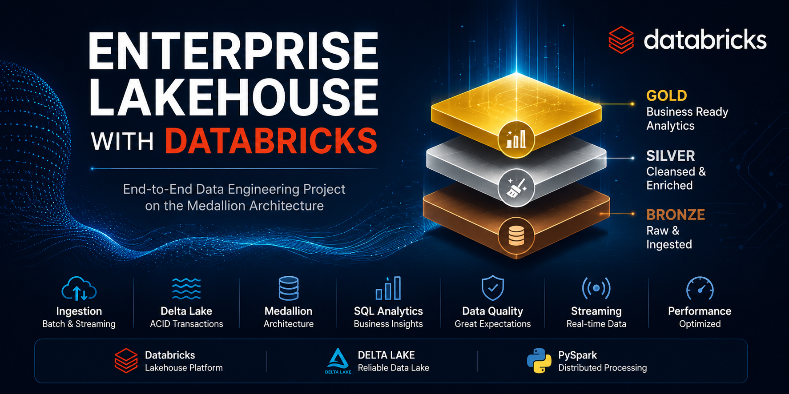
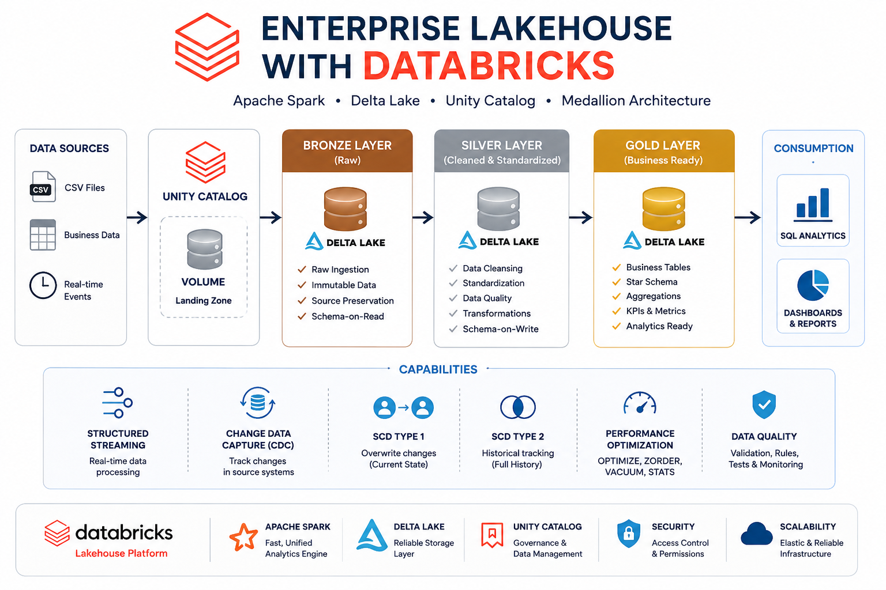
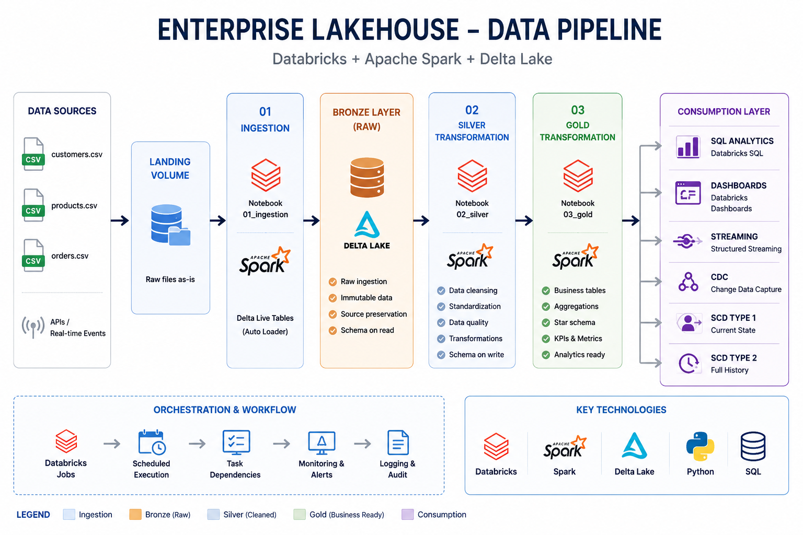
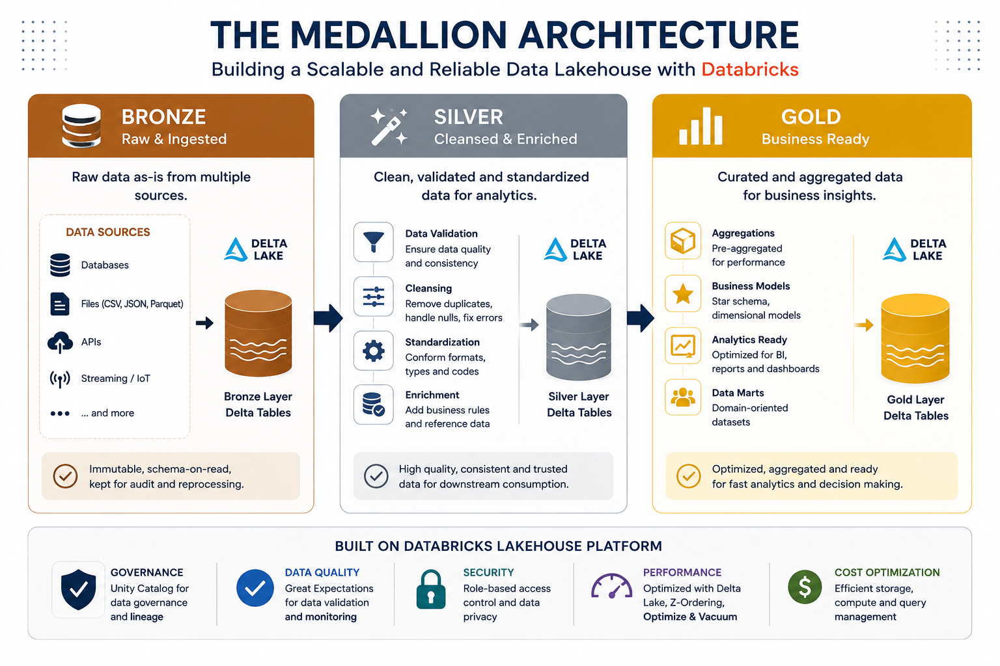

<p align="center">
  
</p>

# Enterprise Lakehouse with Databricks

## Architecture



---

# Project Pipeline

The following diagram illustrates the complete end-to-end data flow implemented in this project.

<p align="center">
  
</p>

# Medallion Architecture

The Medallion Architecture organizes data into three logical layers that progressively improve data quality and business value.

<p align="center">
  
</p>

### Bronze Layer
- Raw data ingestion
- Immutable source data
- Audit and replay support

### Silver Layer
- Cleansed and validated datasets
- Standardization and enrichment
- Business rules applied

### Gold Layer
- Curated analytical datasets
- Star schema modeling
- Business-ready tables for BI and dashboards

## Project Overview

This project demonstrates the implementation of a complete **Enterprise Lakehouse** using **Databricks**, **Apache Spark**, and **Delta Lake**.

The solution follows the **Medallion Architecture (Bronze → Silver → Gold)** and covers ingestion, transformation, optimization, data quality, streaming, dimensional modeling, and business analytics.

---

# Architecture

```
                CSV Files

                    │
                    ▼

           Unity Catalog Volume

                    │
                    ▼

            Bronze Layer (Raw)

                    │
                    ▼

       Silver Layer (Clean & Standardized)

                    │
                    ▼

        Gold Layer (Business Ready)

                    │
                    ▼

         SQL Analytics & Dashboard
```

---

# Technologies

- Databricks
- Apache Spark
- Delta Lake
- Unity Catalog
- Structured Streaming
- Python
- SQL

---

# Medallion Architecture

## Bronze

- Raw ingestion
- Immutable data
- Source preservation

---

## Silver

- Cleansing
- Standardization
- Data Quality
- Transformations

---

## Gold

- Business-ready tables
- Star Schema
- Analytics
- KPIs

---

# Project Structure

```
enterprise-lakehouse-databricks

├── datasets
├── docs
├── images
├── notebooks
├── sql
├── README.md
├── LICENSE
└── requirements.txt
```

---

# Notebooks

| Notebook | Description |
|----------|-------------|
| 01 | Data Ingestion |
| 02 | Silver Layer |
| 03 | Gold Layer |
| 04 | SQL Analytics |
| 05 | Data Quality |
| 06 | Structured Streaming |
| 07 | Change Data Capture |
| 08 | SCD Type 1 |
| 09 | SCD Type 2 |
| 10 | Delta Optimization |
| 11 | Business Dashboard |

---

# Implemented Features

- Medallion Architecture
- Unity Catalog
- Bronze / Silver / Gold Layers
- Structured Streaming
- Delta Lake
- Change Data Capture (CDC)
- Slowly Changing Dimension Type 1
- Slowly Changing Dimension Type 2
- Delta Optimization
- Business Dashboard
- SQL Analytics

---

# Business KPIs

- Total Revenue
- Average Ticket
- Revenue by State
- Revenue by Category
- Top Customers
- Top Products
- Order Status Analysis

---

# Future Improvements

- Auto Loader
- Delta Live Tables
- Lakeflow Pipelines
- CI/CD
- GitHub Actions
- Terraform Deployment
- Azure / AWS Integration

---

# Author

**Marcelo Mendes**

Databricks Certified Data Engineer Associate

GitHub:

https://github.com/MarcelloMendes

LinkedIn:

www.linkedin.com/in/marcelomendes-

---

## License

This project is licensed under the MIT License.
